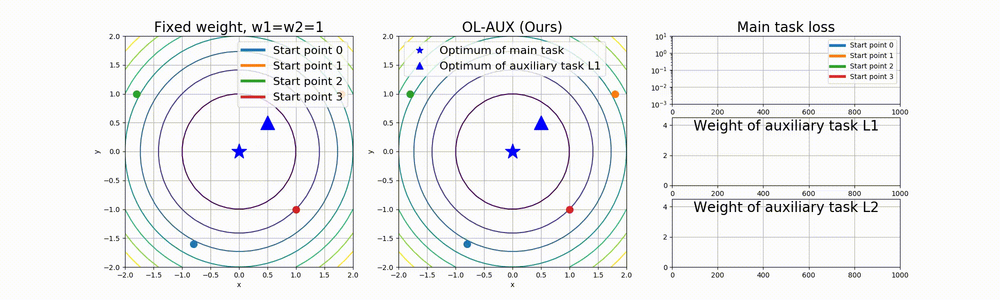

# Adaptive Auxiliary Task Weighting for Reinforcement Learning

Xingyu Lin*, Harjatin Baweja*, George Kantor, David Held

(* indicates equal contributions)

**NeurIPS 2019**  [[paper]](https://papers.nips.cc/paper/8724-adaptive-auxiliary-task-weighting-for-reinforcement-learning) 

## Demo
#### Quadratic Optimization

#### MuJoCo
Below shows the policy learned with OL-AUX on the VisualHandReach, along with some of the auxiliary tasks. From left to right: Observation, goal, auto-encoder reconstruction, predicted optical flow, egomotion transformation image.


## Installation
1. Install [MuJoCo](http://www.mujoco.org/) and [Conda](https://docs.conda.io/en/latest/minicondahtml) if you have not already.
2. Install prerequisite
   
    ```
    sudo apt-get update && sudo apt-get install libopenmpi-dev python3-dev zlib1g-dev
    ```
   
3. Create python environments 

    ```
    conda env create --file environment.yml
    ```
    
4. Check OpenMPI version by running `mpirun --version`. The code is tested under version `2.0.2`. Make sure MPI is correctly installed by running `mpirun -np 2 python baselines/common/mpio_running_mean_std.py`

## Instructions
First add the working directory to `PYTHONPATH`.

### Quadratic example
```
python olaux/quadratic.py
```

The resulted video will be saved to `results/quadratic.mp4`.
 
### MuJoCo experiments
To produce the original results, make sure you have at least 8 CPU cores and ~60G memory. Run

```
. activate olaux 
export MUJOCO_PY_FORCE_CPU=True # Force CPU rendering
export MUJOCO_GL=osmesa 
mkdir data && python olaux/main.py
``` 
Refer to the documentation in `olaux/main.py` for arguments. By default it runs OL-AUX on FetchReach and the data will be saved to 
## Cite Our Paper
If you find this codebase useful in your research, please consider citing:

```
@incollection{NIPS2019_8724,
title = {Adaptive Auxiliary Task Weighting for Reinforcement Learning},
author = {Lin, Xingyu and Baweja, Harjatin and Kantor, George and Held, David},
booktitle = {Advances in Neural Information Processing Systems 32},
editor = {H. Wallach and H. Larochelle and A. Beygelzimer and F. d\textquotesingle Alch\'{e}-Buc and E. Fox and R. Garnett},
pages = {4772--4783},
year = {2019},
publisher = {Curran Associates, Inc.},
url = {http://papers.nips.cc/paper/8724-adaptive-auxiliary-task-weighting-for-reinforcement-learning.pdf}
}
```

## Caveat
Unfortunately, due to a series of accidents with our computing cluster and local computing machines, the original code used to create the plots in the paper was lost. Furthermore, due to complicate immigration situations, one of the authors who contribute siginificantly to the original code cannot legally work on anything related to this paper at the moment. 

This repository is a re-implementation of OL-AUX by one of the authors that mostly reproduces the original results. Please refer to the plots in `./results/` for the reproduced results. However, due to the issues mentioned above, many hyper-parameters and implementation details in this repository may differ from the original code in the paper. We will potentially release another version of the code once the other author is able to legally work again.

We apologize for these issues. Please contact Xingyu Lin (xlin3@andrew.cmu.edu) and David Held (dheld@andrew.cmu.edu) if you have further questions.
 

## References
The code here is based on the DDPG and HER implementation in [OpenAI Baselines](https://github.com/openai/baselines)
